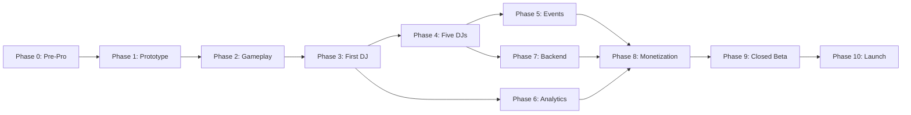

# ZONA T RUNNER - Roadmap de Desarrollo

Este documento detalla las fases de desarrollo para llevar a ZONA T RUNNER desde el concepto hasta su lanzamiento. Estimaciones basadas en un equipo de 1-2 *developers*.

## Flujo de Fases

## Phase 0: Pre-Production
- **Descripción:** Establecer las bases técnicas y de planeación.
- **Entregables:** Documentación base (VISION, ROADMAP, GDD), arquitectura de *ScriptableObjects* en papel, repositorio GitHub configurado, Unity 6 LTS *project setup* con URP.
- **Timeline:** 1-2 semanas.
- **DONE Criteria:** Repositorio en la rama `main` con arquitectura de carpetas, documentos aprobados.

## Phase 1: Prototype Runner
- **Descripción:** Implementar el *core loop* del *runner*.
- **Entregables:** Sistema de 3 carriles (3 lanes), salto (*jump*), deslizamiento (*slide*), generador básico de pista plana, movimiento de cámara.
- **Timeline:** 2 semanas.
- **DONE Criteria:** El jugador puede esquivar cubos básicos infinitamente sin *bugs* de movimiento.

## Phase 2: Gameplay Polish
- **Descripción:** Refinar el *feel* y añadir progresión básica de la partida.
- **Entregables:** Sistema de recolección de monedas, puntuación por distancia, diferentes tipos de obstáculos, *Game Over loop*, *UI* básica (HUD).
- **Timeline:** 2-3 semanas.
- **DONE Criteria:** *Core loop* divertido, balanceado en velocidad, con *feedback* visual básico.
- **Risk Gate:** ¿El juego se siente bien al tacto antes de meterle arte pesado?

## Phase 3: First DJ
- **Descripción:** Probar la arquitectura *Data-Driven* con el primer perfil de DJ.
- **Entregables:** Entorno 3D temático (Bogotá nocturna), integración musical (BPM *sync* o respuesta del entorno), *shaders* de neón, un DJ real configurado vía JSON/ScriptableObjects.
- **Timeline:** 3-4 semanas.
- **DONE Criteria:** Se puede jugar un nivel completo temático que representa visual y sonoramente a 1 DJ específico.

## Phase 4: Five DJs
- **Descripción:** Escalar el sistema para soportar los 5 DJs de lanzamiento.
- **Entregables:** 4 mundos adicionales, sistema robusto de selección de personajes/escenarios, optimización de carga de *assets*.
- **Timeline:** 4-5 semanas.
- **DONE Criteria:** Menú de selección funcional, transición entre mundos fluida, todos los DJs integrados.
- **Risk Gate:** ¿La arquitectura aguanta la carga dinámica sin consumir excesiva memoria RAM?

## Phase 5: Events/Promotions
- **Descripción:** Integrar el componente de plataforma publicitaria nativa.
- **Entregables:** Vallas publicitarias *in-game*, *pop-ups* de eventos, enlaces externos al tocar *banners* en el menú, sistema para actualizar promos sin *patch*.
- **Timeline:** 2 semanas.
- **DONE Criteria:** Las marcas pueden mostrar sus *flyers* dentro del entorno 3D y llevar tráfico a *tickets*.

## Phase 6: Analytics
- **Descripción:** Configurar métricas para medir KPIs.
- **Entregables:** Integración con Unity Analytics / Firebase, *event tracking* (muertes, DJ seleccionado, clics en promos, duración de sesión).
- **Timeline:** 1 semana.
- **DONE Criteria:** Datos llegando correctamente al *dashboard* de analíticas.

## Phase 7: Backend
- **Descripción:** Sistemas en la nube y retención a largo plazo.
- **Entregables:** Autenticación (Apple/Google Play), *Leaderboards* globales y por DJ, *Remote Config* para eventos temporales y ajustes de balanceo.
- **Timeline:** 3 semanas.
- **DONE Criteria:** Jugador puede ver su *ranking* en línea y su perfil está guardado en la nube.
- **Risk Gate:** ¿Es estable el servidor backend?

## Phase 8: Monetization
- **Descripción:** Implementar la economía del juego.
- **Entregables:** *In-App Purchases* (IAP), *Rewarded Video Ads* para revivir, *Battle Pass* básico (o sistema de recompensas progresivo), tienda de *skins*.
- **Timeline:** 3 semanas.
- **DONE Criteria:** Flujo de compra simulado (sandbox) exitoso, anuncios cargando correctamente.

## Phase 9: Closed Beta
- **Descripción:** Pruebas masivas con usuarios reales.
- **Entregables:** *Builds* distribuidos vía TestFlight y Google Play Console (Closed Testing), corrección masiva de *bugs*, pulido de optimización de FPS.
- **Timeline:** 3-4 semanas.
- **DONE Criteria:** 99% *crash-free rate*, 60 FPS estables en dispositivos objetivo de gama media.
- **Risk Gate:** ¿Las métricas de retención justifican el lanzamiento público?

## Phase 10: Launch
- **Descripción:** Salida a producción global (o *soft-launch*).
- **Entregables:** Aprobación en tiendas, *marketing assets* finales, campaña de lanzamiento con los 5 DJs involucrados.
- **Timeline:** 1 semana.
- **DONE Criteria:** Juego en vivo (App Store + Google Play), evento de lanzamiento presencial en club.
