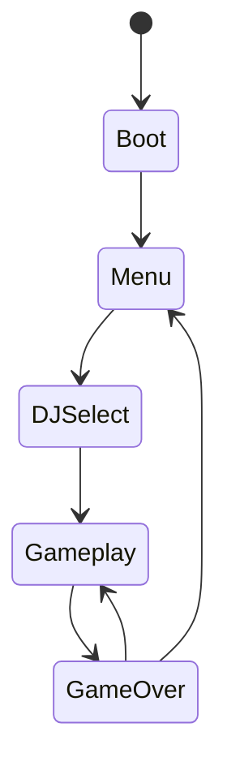
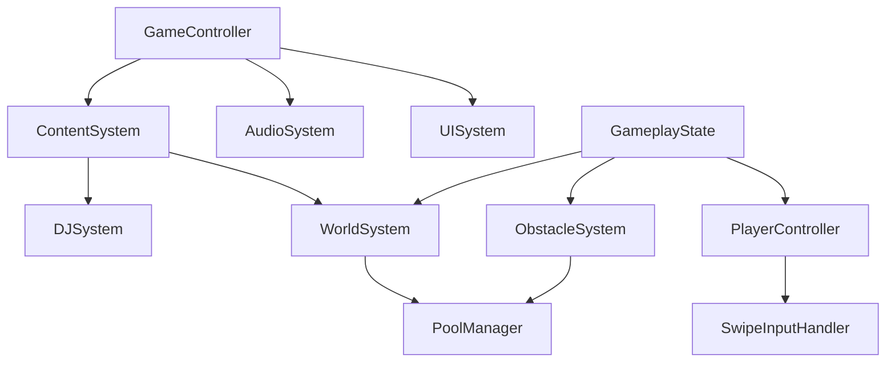

# ZONA T RUNNER - Technical Architecture Document

## 1. Technology Stack
- **Engine:** Unity 6 LTS
- **Language:** C# .NET Standard 2.1
- **Render Pipeline:** Universal Render Pipeline (URP) - Forward Mobile
- **Scripting Backend:** IL2CPP
- **Input:** Unity New Input System

## 2. System Architecture

La arquitectura se divide en 16 sistemas principales, diseñados para ser modulares y escalables.

### Core Systems
- **GameController:** Maneja la máquina de estados principal (Boot → Menu → DJSelect → Gameplay → GameOver).
- **PlayerController:** Gestiona el movimiento del jugador (lane switching, jump, slide, collision).
- **SwipeInputHandler:** Procesa los gestos táctiles.
- **CharacterSystem:** Carga de modelos, animaciones y variantes específicas por DJ.

### Gameplay & Content Systems
- **DJSystem:** Gestión de perfiles, carga de datos y orquestación de la experiencia temática.
- **WorldSystem:** Generación infinita de pistas (track spawning), pooling de segmentos, aplicación de temas (aesthetics) y gestión de *floating origin* para evitar problemas de precisión flotante.
- **ObstacleSystem:** Spawning de patrones, curvas de dificultad y obstáculos específicos por DJ.
- **PowerUpSystem:** Gestión de power-ups (magnet, shield, multiplier, speed, fever mode).

### Audio & UI Systems
- **AudioSystem:** Sincronización de ritmos (`BeatSynchronizer` usando `AudioSettings.dspTime`), `StemMixer` con 4 capas para interactividad musical, y `MusicManager`.
- **UISystem:** Gestión de pantallas, HUD, menús y transiciones.

### Meta & Data Systems
- **ProgressionSystem:** Puntuación, high scores, save/load local.
- **EventSystem:** Displays de eventos in-world y promociones.
- **PromotionSystem:** Gestión de códigos, descuentos y enlaces externos (deep linking).
- **AnalyticsSystem:** Interfaz de tracking de eventos con backends conectables.
- **ContentSystem:** Loader de JSON, factory de `ScriptableObject` y futura integración con Addressables.
- **SaveSystem:** MVP con `PlayerPrefs`, preparado para cloud save.
- **ConfigSystem:** Configuración local y futura configuración remota (remote config).

### Diagramas de Arquitectura

#### Máquina de Estados del Juego (Game State Machine)


#### Relación de Sistemas (Systems Relationship)


## 3. Communication Pattern
El patrón principal de comunicación es un **Event Bus** (basado en C# events y delegates) para asegurar que no existan referencias directas entre sistemas acoplados.

## 4. Data Flow
El flujo de datos sigue una filosofía "Content-Driven":
`Config JSON` → `ContentSystem` → `ScriptableObjects` → `Systems` → `GameObjects`

## 5. Object Pooling Strategy
Se implementa una estrategia de pooling genérico para evitar picos de Garbage Collection (GC).

```csharp
public class ObjectPool<T> where T : MonoBehaviour
{
    // Implementación de pool pre-alocado para track segments, obstáculos, monedas y VFX
}
```

## 6. Scene Architecture
La carga de escenas sigue un flujo lineal aditivo:
`Boot` → `MainMenu` → `DJSelect` → `Gameplay` (carga aditiva para la UI).

## 7. Performance Targets
> [!IMPORTANT]
> - 60fps en dispositivos tipo Snapdragon 600+.
> - **0 GC allocation** por frame durante el gameplay.
> - Consumo de RAM < 300MB.
> - Tamaño del APK base < 60MB.
> - Cold start < 3 segundos.

## 8. Folder & Namespace Structure
```text
ZonaTRunner/
  ├── Core/
  ├── Player/
  ├── DJ/
  ├── World/
  ├── Audio/
  ├── ...
```
Namespace principal: `ZonaTRunner.Core`, `ZonaTRunner.Player`, etc.

## 9. Third-Party Dependencies
- `com.unity.inputsystem`
- `Newtonsoft.Json` (vía Unity package)
- `com.unity.addressables` (Planeado para FASE 3+)

## 10. Future Architecture Considerations
- **Backend integration points**: APIs para leaderboards y validación.
- **Remote config hooks**: Ajuste de dificultad y features en vivo.
- **A/B testing interfaces**: Inyección de variantes a través de `ConfigSystem`.

### C# Interfaces Reference

```csharp
public interface IDJProfile
{
    string DJId { get; }
    string DisplayName { get; }
    void InitializeTheme();
}

public interface IAnalyticsProvider
{
    void TrackEvent(string eventName, Dictionary<string, object> parameters);
}

public interface IContentLoader
{
    T LoadContent<T>(string path) where T : ScriptableObject;
}
```
