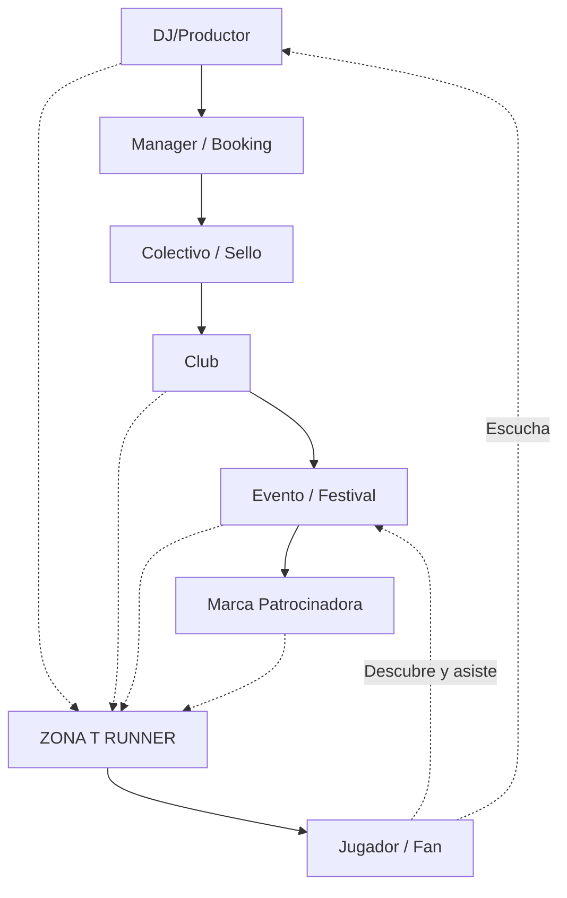

# ZONA T RUNNER - Vision Document

## Misión
Democratizar la conexión entre artistas electrónicos y su audiencia a través del *gaming*. ZONA T RUNNER busca ser el puente interactivo que une la cultura nocturna de Bogotá con los jugadores.

## El Problema
Actualmente, los DJs, *clubs* y eventos luchan por alcanzar nuevas audiencias digitalmente más allá de las redes sociales tradicionales. La saturación de contenido hace difícil destacar y construir una base de fans leal y comprometida de forma innovadora.

## La Solución
Un juego *endless runner* móvil que ES la plataforma. Cada partida es una inmersión en el universo de un DJ, donde la música, la estética y los obstáculos reflejan su identidad. Es un canal de promoción nativo, interactivo y gamificado.

## Ecosistema (Platform Architecture)

## Visión a Largo Plazo
- **Escala de Contenido:** Evolucionar de un *roster* inicial de 5 DJs locales a una plataforma masiva con capacidad de soportar hasta 500 artistas, sin romper la arquitectura base (Data-Driven).
- **Expansión Geográfica:** Empezar con el nicho y estética de Bogotá para luego expandirse a otras capitales de la música electrónica en Latinoamérica.

## Valores Core
- **Identidad Colombiana:** Auténtica representación de la cultura nocturna (*urban, nocturnal, underground, electronic, neon, concrete*).
- **Respeto por el Artista:** Cada DJ es tratado como un mundo único, no como un simple *skin*.
- **Calidad > Cantidad:** Experiencias pulidas de *gameplay* y diseño audiovisual de alto nivel.

## Métricas de Éxito (KPIs)
- **Player Retention:** Retención de Día 1, 7 y 30.
- **DJ Discovery:** Clics hacia perfiles de Spotify/Soundcloud de los artistas desde el juego.
- **Event Conversions:** Interacciones y redención de códigos de promoción en eventos del mundo real.
- **Community Growth:** Crecimiento de la comunidad en Discord/redes sociales ligada al juego.

## Lo que ZONA T RUNNER NO es
- **NO es un clon de Subway Surfers:** Tiene su propia identidad estética y mecánica, centrado en la inmersión musical.
- **NO es un *casual throwaway game*:** Tiene progresión, *lore* y conexión con la realidad.
- **NO es un *generic runner*:** Todo elemento del entorno tiene un propósito narrativo o de marketing orgánico.
